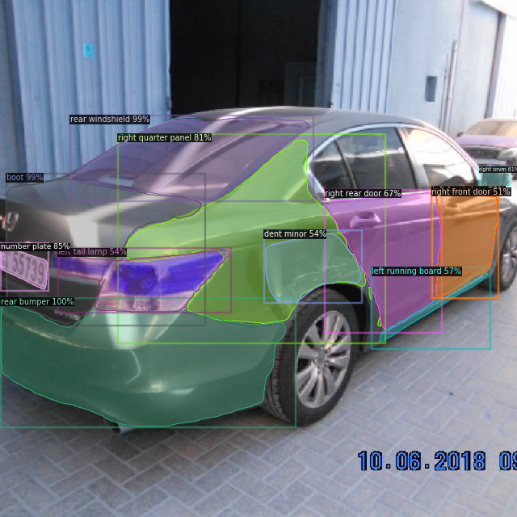
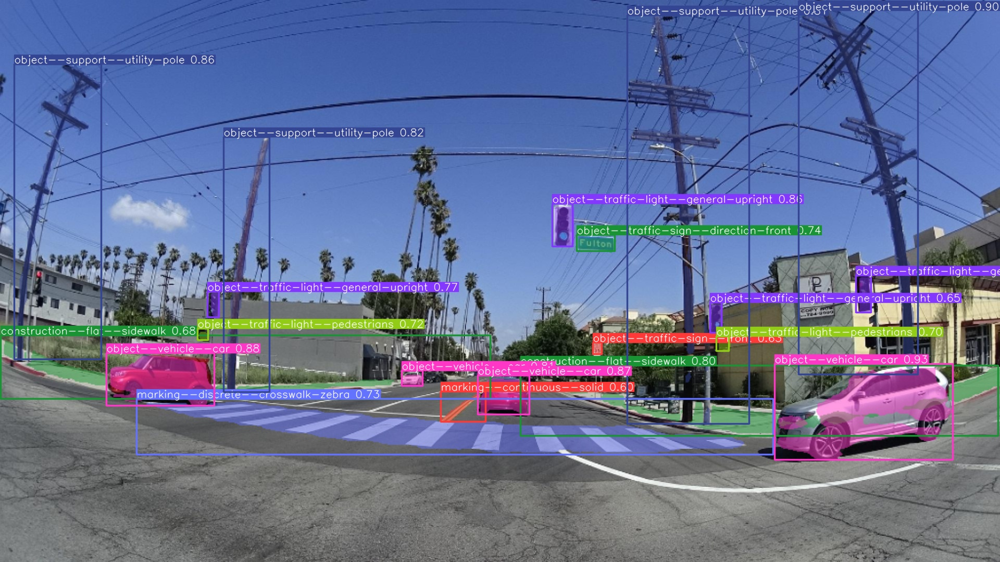
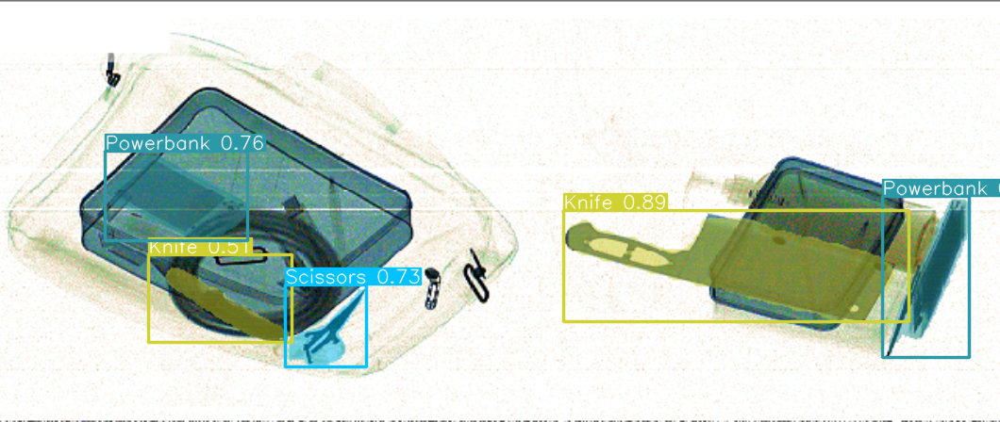

# 2D Computer Vision Expertise (Object Detection & Segmentation)

## Overview
This project showcases expertise in 2D computer vision, focusing on object detection and instance segmentation. It involves collaborative strategy, versatile model training, automated annotation, optimization, and advanced deployment techniques.

## Project Details
### Objective
The main objectives of this project are:
1. Define and execute the vision for advanced AI solutions in computer vision.
2. Train and optimize state-of-the-art models for 2D object detection and segmentation.
3. Automate image annotation to enhance data preparation efficiency.
4. Optimize model performance using systematic management and fine-tuning.
5. Lead and develop a high-fidelity annotation team.
6. Implement advanced techniques for efficient deployment and enhanced applications.

### Methodology
#### Collaborative Strategy
- **Vision Execution**: Worked closely with the CEO to define and implement the company's AI vision, ensuring alignment with business goals.

#### Versatile Model Training
- **Model Proficiency**: Trained and optimized models including Detectron2, YOLO, and SSD for various tasks in 2D object detection and instance segmentation.

#### Automated Annotation
- **Tool Development**: Designed and deployed an automatic image annotation tool to speed up and standardize the data preparation process.

#### Optimization and Monitoring
- **Performance Management**: Used WandB.ai to manage and fine-tune diverse model configurations, ensuring top-tier performance metrics.

#### Focused Team Leadership
- **Team Direction**: Led and upskilled an annotation team, focusing on producing high-fidelity annotated data for 2D visual tasks.

#### Advanced Techniques
- **Model Pruning**: Implemented model pruning strategies for efficient deployment.
- **Mask Extraction**: Executed mask extraction techniques for enhanced blueprint mapping applications.

### Features
1. **Collaborative Strategy Execution**: Align AI solutions with business goals through close collaboration with leadership.
2. **State-of-the-Art Model Training**: Expertise in training and optimizing leading models for 2D object detection and segmentation.
3. **Automated Annotation Tool**: Speed up and standardize data preparation with custom annotation tools.
4. **Systematic Optimization**: Ensure high performance using WandB.ai for model configuration management.
5. **High-Fidelity Annotation**: Lead teams to produce high-quality annotated data.
6. **Advanced Deployment Techniques**: Implement pruning and mask extraction for efficient and enhanced applications.

## Example Projects

### 1. Vehicle Damage Assessment
**Description:** This project involves detecting and assessing vehicle damage from images. The model is trained to identify different types of damage, such as dents, scratches, and broken parts.

**Features:**
- Accurate damage detection
- Classification of damage types
- Severity assessment

### 2. Road Assets Detection
**Description:** This project utilizes the Mapillary dataset to detect and classify various road assets such as traffic signs, street lights, and road markings. The model enhances the accuracy of asset management and urban planning.

**Features:**
- Comprehensive detection of road assets
- Integration with GIS systems for urban planning
- Real-time monitoring and management of road infrastructure
  
### 3. Construction PPE Detection
**Description:** This project focuses on detecting personal protective equipment (PPE) on construction workers to ensure safety compliance. The model identifies helmets, vests, gloves, and other PPE items.

**Features:**
- Real-time PPE detection
- Compliance monitoring
- Safety alerts

### 4. X-ray Scanner
**Description:** This project involves using 2D object detection and segmentation techniques to analyze X-ray images, identifying objects and potential threats.

**Features:**
- High accuracy in object detection
- Threat identification
- Automated analysis

### Benefits
- **Enhanced Efficiency:** Automated annotation and model optimization streamline workflows.
- **High Performance:** Fine-tuned models ensure top-tier performance in detection and segmentation tasks.
- **Scalability:** Advanced deployment techniques allow for scalable and efficient AI solutions.

### Running the Models
To use the models:
1. Ensure your environment is set up with the necessary tools (e.g., PyTorch, Detectron2, YOLO).
2. Load your dataset into the specified directories.
3. Run the preprocessing and annotation scripts to prepare the data.
4. Execute the training scripts to train the object detection and segmentation models.
5. Optimize and monitor performance using WandB.ai.
6. Deploy the models and perform post-processing tasks as needed.
